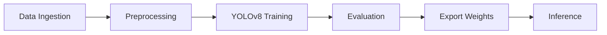

# 📄 Arabic Document Layout Analysis Agent (ML-only)

A state-of-the-art computer vision solution for detecting and classifying document layout elements in Arabic documents using YOLOv8 architecture.


## 🎯 Overview

This repository contains the machine learning pipeline for **Arabic Document Layout Analysis** - a comprehensive solution for automatically detecting and classifying structural elements in Arabic documents including titles, paragraphs, tables, figures, and more. This is the ML-only repository focusing on training, evaluation, and inference workflows.

> **Note**: For the production web service and API, please refer to the separate FastAPI repository.

## 🚀 Motivation

- **Automate document analysis** for large-scale digitization projects
- **Enable intelligent information extraction** from Arabic documents
- **Build production-ready pipelines** for downstream tasks like OCR and semantic parsing
- **Support digital transformation** of Arabic document archives and repositories

## 📊 Repository Structure

```plaintext
arabic-document-layout-analysis/
├── 📁 data/
│   └── data.yaml                 # Dataset configuration (paths & classes)
├── 📁 notebooks/
│   ├── 01_data_preparation.ipynb
│   ├── 02_training.ipynb
│   ├── 03_evaluation.ipynb
│   ├── 04_inference_and_api.ipynb
│   └── 05_dataset_unification_and_active_learning.ipynb
├── 📁 results/
│   ├── baseline_results.txt      # Baseline (Iteration 1) metrics
│   └── final_results.txt         # Final (Iteration 2) metrics
├── 📁 src/
│   ├── __init__.py
│   ├── config.py                 # Training configuration (imgsz=1280, epochs=80)
│   ├── evaluate.py
│   ├── infer.py
│   ├── train.py
│   └── 📁 utils/
│       ├── __init__.py
│       └── visualize.py
├── 📁 tools/
│   ├── convert_pdfs.py
│   ├── dataset.py
│   ├── build_unified_dataset.py
│   ├── add_new_annotations.py
│   ├── select_uncertain.py
│   ├── make_overlays_from_labels.py
│   └── synthesize_longtail.py
├── .gitignore
├── LICENSE
├── requirements.txt
└── README.md
```

## 📈 Dataset Summary

| Aspect | Specification |
|--------|---------------|
| **Format** | YOLO format (images/ + labels/ with .txt files) |
| **Classes** | 12-class taxonomy (configurable in `data/data.yaml`) |
| **Training Set** | 205 images (190 baseline + 15 hard pages) |
| **Validation Set** | 47 images, 814 instances (locked) |
| **Recommended Structure** | Raw PDFs in `data/raw/`, processed data in `data/processed/` |

## 🔄 ML Pipeline



## ⚙️ Training Configuration

| Setting | Baseline (Iter. 1) | Final (Iter. 2) |
|---------|-------------------|-----------------|
| **Model** | YOLOv8s | YOLOv8s |
| **Image Size** | 640 | 1280 |
| **Epochs** | 50 | 80 |
| **Patience** | 20 | 30 |
| **Batch Size** | 16 | 16 |
| **Learning Rate** | 0.01 | 0.01 |
| **Device** | CPU | CPU |

> **Note**: Final configuration is set as default in `src/config.py`

## 🎯 Post-Processing Configuration

Optimal thresholds from experimental results:

```json
{
  "nms_iou": 0.50,
  "min_area_frac": { 
    "Table": 0.0008, 
    "Image": 0.0008 
  },
  "conf": {
    "Title": 0.45, "Text": 0.40, "Caption": 0.35,
    "Table": 0.40, "Image": 0.50,
    "Footer": 0.30, "Stamp/Signature": 0.45,
    "List-item": 0.35, "Keyvalue": 0.30, "Check-box": 0.30
  }
}
```

## 📊 Performance Metrics

| Metric | Value |
|--------|-------|
| **CPU Inference Latency** | ~0.6 s/image at 1280px |
| **Strong Classes (mAP)** | Image (~0.785), Caption (~0.770), Table (~0.565) |
| **Challenging Classes** | Footer (~0.173), Keyvalue (~0.0047), Check-box (~0.0) |

## 🛠 Installation & Setup

### 1. Create Virtual Environment

```bash
# Windows
python -m venv venv
.\venv\Scripts\Activate.ps1

# Linux/Mac
python -m venv venv
source venv/bin/activate
```

### 2. Install Dependencies

```bash
pip install -r requirements.txt
```

> **CUDA Users**: Install PyTorch compatible with your GPU from [pytorch.org](https://pytorch.org) before installing requirements.

## 🚀 Quick Start

### 1. Training

Ensure your `data/data.yaml` is properly configured with image paths and class names:

```bash
python -m src.train
```

### 2. Evaluation

Evaluate trained model performance:

```bash
python -c "from src.evaluate import evaluate; evaluate('models/best.pt')"
```

### 3. Inference

Run inference on validation images:

```bash
python -c "from src.infer import infer; infer('models/best.pt', 'data/processed/images/val')"
```

## 📝 Model Checkpoints

> **Note**: This repository does not include pre-trained weights. Place your trained models under `models/` directory (git-ignored) and update paths accordingly.

## 💡 Key Insights & Lessons Learned

- **Data Quality**: Label consistency is critical for detection performance
- **Class Balance**: Balanced datasets stabilize training and improve recall
- **Evaluation Strategy**: Comprehensive metrics (mAP@50-95) guide model selection
- **Ablation Studies**: Systematic experiments validate architectural choices

## 🎯 Future Roadmap

- [ ] **Multi-lingual adaptation** for diverse document types
- [ ] **Domain-specific fine-tuning** for specialized documents
- [ ] **Structure reconstruction** for reading order and region analysis
- [ ] **Optimized deployment** with ONNX/TensorRT for faster inference
- [ ] **Active learning integration** for continuous improvement

## 👨‍💻 Author

**Ayhem Boukari**  
- 📧 Email: [ayhem.boukari@enicar.ucar.tn](mailto:ayhem.boukari@enicar.ucar.tn)  
- 💼 LinkedIn: [Ayhem Boukari](https://www.linkedin.com/in/ayhem-boukari-3889b528b/)  
- 🏫 Institution: National Engineering School of Carthage (ENICar)

## 📄 License

This project is licensed under the MIT License - see the [LICENSE](LICENSE) file for details.

---

## 🤝 Contributing

We welcome contributions! Please feel free to submit issues, feature requests, or pull requests to help improve this project.

## ⭐ Acknowledgments

- Ultralytics for the YOLOv8 framework
- Research community for document layout analysis benchmarks
- Open-source computer vision libraries that made this work possible

---

**Built with ❤️ for advancing Arabic document analysis technology**
